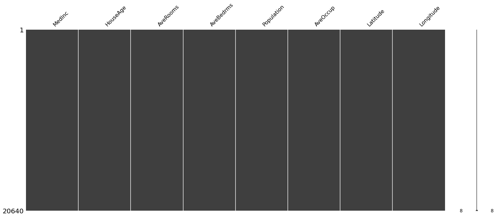
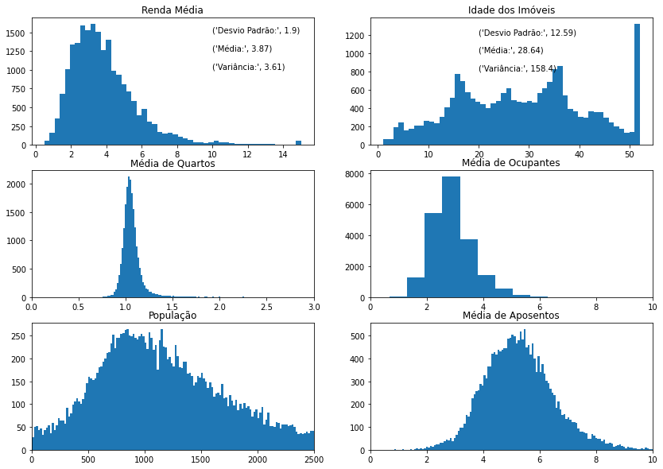
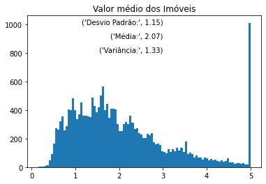
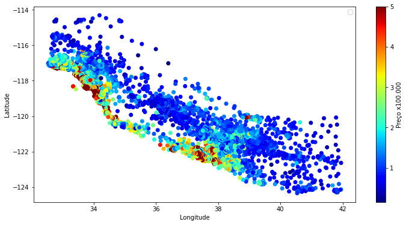
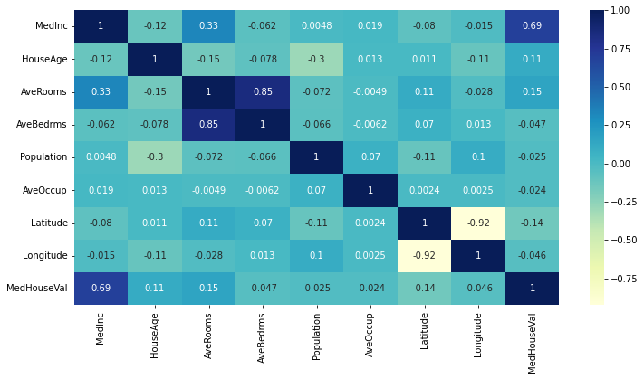

# house-price-regression

## Objetivo

O objetivo desse projeto é estudar a aplicação de técnicas de regressão para prever o preço de imóveis de barrios da california. Para isso, será utilizada a base de dados pronta da biblioteca Sklearn, e referência de estudos do livro Géron (2019).

## Dados

Os dados são compostos de 9 colunas e 20640 linhas. São 8 features e 1 target conforme a relação abaixo: 

- Median Income: Valor médio da renda da população do bairro; 
- Average Bedrooms: Valor médio de quartos no bairro;
- Average Rooms: Valor médio de aposentos;
- Average Occupants: Valor médio de ocupantes dos imóveis; 
- Population: População do Bairro; 
- Average Age: Idade Média dos Imóveis; 
- Latitude: Posição geográfica;
- Longitude: Posição geográfica;
- Median House Value: Valor médio dos imóveis no Bairro. Essa coluna é o target dos dados. 

Por se tratar de uma base de dados feita para estudos, sua estrutura é bastante limpa e não possui células vazias. 

Todos as colunas são atributos do tipo float, e assim são analisados com histogramas e medidas de estatistica descritiva. 

- A idade dos imóveis é bastante dispersa, com alta variância. Além disso existe uma grande quantidade de dados com idade próxima de 50. 
- A renda média da população possui uma variância moderada, mas os dados estão deslocados para a direita da média. 

Assim como a idade média dos imóveis, o preço também é disperso. Inclusive este conjunto de dados possui uma grande quantidade de valores acima de $500.000, que pode ocasionar problemas no treinamento dos modelos. O desempenho será comparado no treinamento de cada um. 

Com o plot de posição geográfica dos dados, é possível identificar que os bairros mais próximos do litoral são são mais caros. 

Por fim, a análise de correlação mostra que a maior relação com o target é a renda média do bairro. 

## Organização dos arquivos

- [Figuras](figuras)
- [Análise dos dados](housing-california-data-analysis.ipynb)
- [Análise de Regressão](housing-california-regression.ipynb)

## Desempenho das técnicas de Machine Learning

Em Andamento.

## Conclusão

Em Andamento. 

## Referências

AURÉLIEN GÉRON. Hands-On Machine Learning with Scikit-Learn, Keras, and Tensorflow: Concepts, Tools, and Techniques to Build Intelligent Systems. 2nd ed. [S. l.]: O’Reilly Media, 2019.

